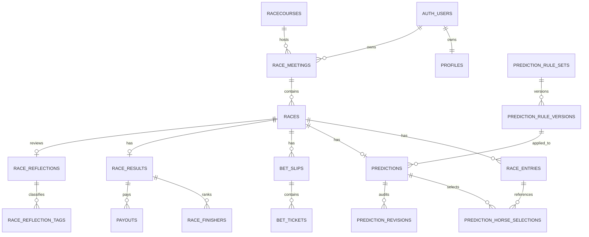

# データベース設計

## 方針

Supabase PostgreSQLを正本とし、すべてのユーザーデータを`auth.uid()`単位で分離する。買い目は「1行 = 1つの具体的な組み合わせ（1点）」として保存し、BOX・流し・フォーメーションはクライアントで具体的な組み合わせへ展開する。このため、点数・投資額・的中判定・払戻計算が曖昧にならない。

予想案と実購入は同じ券面構造を共有するが、`bet_slips.kind`の`proposal`と`actual`で明確に分離する。外部投票サービスとの接続、投票API、投票指示を送る機能は設計・実装ともに含まない。

## 主な関連



## テーブル

|領域|テーブル|用途|
|---|---|---|
|ユーザー|`profiles`|表示名・タイムゾーン|
|開催|`racecourses`|競馬場マスター|
|開催|`race_meetings`|開催日・競馬場・天候・馬場|
|開催|`races`|レース番号・発走時刻・距離・芝/ダート・収支区分（live/demo/test）|
|出走馬|`race_entries`|馬番・馬名・人気・オッズなど|
|ルール|`prediction_rule_sets`|予想ルールの論理的なまとまり|
|ルール|`prediction_rule_versions`|変更不可の公開版を含むバージョン|
|予想|`predictions`|展開・馬場・買い/見送り・ロック状態|
|予想|`prediction_horse_selections`|印・選出馬・危険人気・穴馬|
|履歴|`prediction_revisions`|予想と選出馬の変更前後JSON|
|券面|`bet_slips`|予想案または実購入の券面|
|券面|`bet_tickets`|具体的な買い目1点と1点金額|
|結果|`race_results`|確定状態|
|結果|`race_finishers`|着順|
|結果|`payouts`|100円あたり払戻|
|反省|`race_reflections`|良かった点・失敗・次回行動|
|反省|`race_reflection_tags`|反省分類|
|交換|`race_exchange_documents`|インポート/エクスポート記録|

## 券種と点数

`bet_type`は次の値を使う。

|値|券種|馬の数|順序|
|---|---|---:|---|
|`win`|単勝|1|なし|
|`quinella`|馬連|2|なし|
|`wide`|ワイド|2|なし|
|`trio`|3連複|3|なし|
|`trifecta`|3連単|3|あり|

順序なし券種は馬番昇順へ正規化する。券面の点数は`bet_tickets`の件数、合計投資額は`stake_yen`の合計である。`stake_yen`は100円以上、100円単位に制約される。

## 予想ロックと変更履歴

- `lock_prediction(prediction_id)`でドラフトを明示的にロックする。
- 発走時刻以後は、保存状態がドラフトでも予想と選出馬の変更をDBトリガーが拒否する。
- ロックは一方向で、解除RPCは用意しない。
- ロック前の予想・選出馬の追加、変更、削除は`prediction_revisions`へ変更前後のJSONと操作者、時刻を追記する。
- `prediction_revisions`はユーザーから更新・削除できない。
- 過去データの`---RACE---`インポートは、作成トランザクション内だけ組み立て可能な`import`スナップショットとして保存し、その後は変更不可となる。
- `proposal`券面は予想ロック／発走後に変更できない。`actual`券面は購入記録の後入力・訂正に対応するため発走後も編集でき、収支は常に`actual`だけを参照する。
- 開催日・競馬場・番号・発走時刻は、発走前のドラフトに限り訂正できる。開催変更時は共有開催行を書き換えず、対象開催へレースを移す。

## 予想ルールのバージョン

`prediction_rule_sets`が選択可能なルール版のコンテナ、`prediction_rule_versions`が本文・パラメータ・版番号を持つ。UIの`2.3.0`のような意味バージョンは`parameters.semantic_version`へ保持し、各版を変更不可の`published`行として保存する。利用中の版だけコンテナの`is_active`を有効にする。予想は`rule_version_id`で公開版を参照し、DBトリガーが`rule_snapshot`を生成するため、将来ルールを整理しても当時の内容を確認できる。

## 収支計算

DBビューが次を提供する。

|ビュー|内容|
|---|---|
|`v_bet_slip_totals`|券面ごとの点数・合計投資額|
|`v_ticket_settlements`|実購入1点ごとの的中・払戻|
|`v_race_financial_summary`|レースごとの投資・払戻・収支・回収率|
|`v_monthly_financial_summary`|月単位の投資・払戻・収支・回収率|
|`v_prediction_overview`|予想の実効ロック状態と選出数|

払戻は`stake_yen / 100 × payout_per_100_yen`、収支は`払戻 - 実購入投資額`、回収率は`払戻 / 実購入投資額 × 100`で算出する。結果が公式確定前の場合、払戻・収支・回収率は`NULL`とし、未確定を損失扱いしない。`v_race_financial_summary`と月次集計は`races.data_scope = 'live'`だけを対象とし、`demo`と`test`は記録を残したまま実績から除外する。

## RLS

- `racecourses`と`reflection_categories`は認証済みユーザーが読み取り可能な共有マスター。
- それ以外は開催の`owner_id = auth.uid()`を起点に所有者を検証する。
- 子テーブルへ別ユーザーのIDを差し込めないよう、RLSに加えて整合性トリガーでも同一レースを検証する。
- 既存の通常CRUDは`security invoker`とRLSを使用する。version付き同期RPCは集約を原子的に更新するため`security definer`とし、固定`search_path`、`auth.uid()`、所有者複合FK、入力hashを検証したうえで、内部helperの実行権限を一般ロールから剥奪する。
- 未認証（`anon`）にはアプリテーブル/RPCの権限を与えない。

## JSON RPC

モバイルUIは次のRPCを利用できる。

- `get_race_records()`：自分のレースを発走時刻降順のJSON配列で取得
- `get_race_record(p_race_id)`：1レースを入れ子JSONで取得
- `upsert_race_record(payload)`：1レース分を1トランザクションで保存
- `lock_prediction(p_prediction_id)`：予想をロック

最小の`upsert_race_record`入力例：

```json
{
  "meeting": {
    "meeting_date": "2026-07-18",
    "meeting_number": 1,
    "racecourse": { "code": "TOKYO" }
  },
  "race": {
    "race_number": 11,
    "starts_at": "2026-07-18T15:45:00+09:00",
    "name": "メインレース",
    "surface": "turf",
    "distance_m": 2000
  },
  "entries": [
    { "horse_number": 1, "horse_name": "サンプルホース" }
  ],
  "prediction": {
    "pace": "middle",
    "decision": "buy",
    "selections": [
      { "horse_number": 1, "mark": "honmei", "is_key": true }
    ]
  },
  "bet_slips": [
    {
      "kind": "proposal",
      "title": "最終案",
      "tickets": [
        { "bet_type": "win", "first_horse_number": 1, "stake_yen": 500 }
      ]
    }
  ]
}
```

既存レースの更新時は最上位の`id`へレースUUIDを指定する。買い目は`first_horse_number`、`second_horse_number`、`third_horse_number`の代わりに`selections: [1, 2, 3]`も使用できる。`upsert_race_record`はRLS対象であり、他ユーザーのUUIDを渡すと「存在しない/アクセス不可」として失敗する。

## `---RACE---`形式

正規仕様は`lib/race-format.ts`のRACE/1である。UTF-8の行指向形式で、1ファイルに複数レースを格納できる。各レースは次のようにマーカーで囲み、値は各行の`KEY:`以降へJSONリテラルとして記録する。

```text
---RACE---
FORMAT_VERSION: 1
ID: "race-id"
DATE: "2026-07-18"
COURSE: "東京"
RACE_NUMBER: 11
START_TIME: "15:45"
NAME: "メインレース"
PREDICTION: {"selectedHorses":[],"paceScenario":"..."}
PROPOSED_BETS: []
PURCHASED_BETS: []
LOCK: {"isLocked":false,"lockedAt":null,"revisions":[]}
RESULT: null
REFLECTION: null
RULE_VERSION: null
CREATED_AT: "2026-07-17T12:00:00.000Z"
UPDATED_AT: "2026-07-17T12:00:00.000Z"
---END RACE---
```

UIで`lib/race-format.ts`により形式・必須キー・値を検証し、RaceRecordからDB用JSONへ変換した後に`upsert_race_record`を呼ぶ。エクスポートもUIでDB用JSONをRaceRecordへ戻してからRACE/1へ変換する。DB独自の交換形式は持たない。`race_exchange_documents`は、必要に応じて元文書、方向、処理状態を監査保存するためのテーブルである。

## 適用

Supabase CLIを使用する場合：

```bash
supabase db reset
```

クラウドへ反映する場合：

```bash
supabase link --project-ref <project-ref>
supabase db push
```

マイグレーションは`supabase/migrations/0001_initial_schema.sql`、共有マスターは`supabase/seed.sql`にある。

## クラウド同期プロトコル

既存の`0001`と`0002`は変更せず、`0003_cloud_tenancy.sql`以降を前進適用する。`racecourses`と`reflection_categories`は共有マスターであり、それ以外のユーザーデータ行は直接`user_id`を持つ。親子関係には`(user_id, id)`の複合外部キーを設定し、別ユーザーの親IDを子行へ差し込めない構造にする。

全テーブルでRLSを有効化する。ユーザーテーブルの基本条件は`user_id = (select auth.uid())`、共有マスターは`authenticated`の読み取りだけである。集約配下の直接INSERT／UPDATE／DELETEは取り消し、公開RPCからだけ更新する。権限昇格する内部helperは一般ロールから実行権限を剥奪し、公開RPCでは`auth.uid()`、固定`search_path`、入力hashを検証する。

レース、ルール、設定には単調増加する`sync_version`を持たせる。更新RPCは`expected_version`と`mutation_id`を必須とし、version不一致時は何も更新せず現在のクラウド値を返す。同じmutation IDと同じpayload hashの再送は保存済みresponseを返し、異なるpayloadでのmutation ID再利用は拒否する。

`sync_change_log`はユーザー別の差分cursorを提供し、Realtime通知は差分取得のきっかけにだけ使用する。削除を実装する場合はroot集約のtombstoneをchange logへ記録し、端末側の古いキャッシュを復活させない。

明示ロック時は`prediction_locked_snapshots`へ、レース識別、発走時刻、予想、選出馬、危険人気、穴馬、ルールsnapshot、proposal券面を正規化して保存する。実購入、結果、払戻、反省はロック後も更新できるため含めない。snapshot行はhash付きでUPDATE／DELETE禁止とする。

端末移行は`local_migration_documents`と`local_migration_items`へdocument hash、record hash、対象ID、期待version、状態を保存する。通常の`race_exchange_documents`とは分離し、成功済み項目を再登録せず同じ端末から再開できる。

発走時刻後に初めて届いた通常Outboxの未ロック予想は、正規化された予想行を新規作成せず、所有者検証済み`races.client_record`の現在メモとして保持するため、`prediction_locked_snapshots`は作らない。オフライン中に発走前の明示ロックを完了していた場合だけ、完全snapshot・ロック時刻・レース識別を検証し、`offline_prediction_locked_snapshots`へクライアント時刻由来のsource付き証跡として追記する。`v0.1.1-local-clean`の旧ロックは、旧UIで固定済みだった予想・proposal券面・ルールから`legacy_local_upgrade`として再構成する。どちらもUPDATE／DELETEを禁止し、サーバー上で発走前に実行した`lock_rpc`証跡とは区別する。
